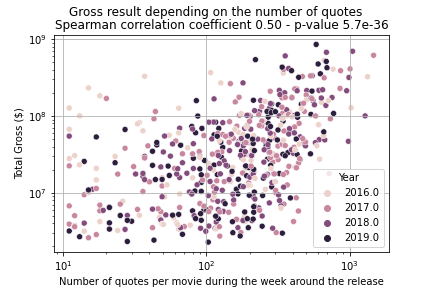

Recent research work has investigated the impact of attributes (e.g., budget, release time) in predicting the box-office revenues[^Early-Predictions-of-Movie-Success]. Particularly, lead actors have been considered as one of the critical drivers for success in the motion pictures industry[^The-Power-of-Stars].

[^Early-Predictions-of-Movie-Success]: https://arxiv.org/abs/1506.05382
[^The-Power-of-Stars]: https://journals.sagepub.com/doi/10.1509/jmkg.71.4.102

However, an important attribute in forecasting the box-office receipts has remained mostly unnoticed: what and how people talk about movies in the media.

How people talk about a movie in the media is not only a way to know a speaker's view about a movie, but it will also others and could indicate the eventual success of a movie.

One salient research question in our study is to examine **how the sentiments in the quotes related to a movie influence the box office revenue after the opening period**. We perform text analysis and statistical testing methods to show which text features from a speaker's quotes might influence the box-office revenue.

We perform two analysis, the first one is only interested in the quotes from someone related to the movie (actor, director, etc), while the second uses all the quotes that mention the title of the movie, or a related term.

## Introduction

The motion pictures industry has become a roaring success that reached a all time high 42 billion U.S. dollars in the global box office in 2019[^box-office-revenue-2019]. In U.S. and Canada, the box office receipt is over 10 billion U.S. dollars in the year of 2015-2019[^us-box-office-revenue-per-year].


*Global box office revenue per year by format, from [^global-box-office-revenue-per-year]*

[^us-box-office-revenue-per-year]: https://www.boxofficemojo.com/year/
[^box-office-revenue-2019]: https://www.billboard.com/articles/news/8547827/2019-global-box-office-revenue-hit-record-425b-despite-4-percent-dip-in-us
[^global-box-office-revenue-per-year]: https://www.statista.com/statistics/259987/global-box-office-revenue

In recent years, numerous research work has uncovered which attributes might predict the financial success of motion pictures after they were released, and why some movies could be "hits" or "flops" using automation methods[^buzz-recommandation-internet][^blogs-advertising-local-market][^predicting-motion-picture].

[^buzz-recommandation-internet]: [Buzz et recommandations sur Internet: quels effets sur le box-office?](https://doi.org/10.1177%2F076737010702200304)
[^blogs-advertising-local-market]: [Blogs, Advertising, and Local-Market Movie Box Office Performance](https://doi.org/10.1287/mnsc.2013.1732)
[^predicting-motion-picture]: [Predicting box-office success of motion pictures with neural networks](https://doi.org/10.1016/j.eswa.2005.07.018)

We explore the important role of the quotes related to movies in the media, and its effects on influencing audiences' decision to go to the cinema after its release. In particular, we are focused on the proportion of opening revenue (revenue in the first week) in the overall box-office revenue, to measure the financial success of movies.

It is more relevant to examine the effectiveness of a speaker's quotes on the box office revenue. We expect that how people talk about movies in the media will not generate immediate effect on box office revenue in a very short time period (i.e., within one week after release dates). More people are interested in going to cinema after the positive reviews has widely spread over a period of time in public.

In our study, we investigate the following sub-questions:

* [*Does the quantity of quotes from the main film crew provide a boost to box-office revenue ?*](#1-influence-of-the-movie-crews-quotes)
* *How much does the sentiment polarity of movie related quotes influence the total box-office revenue ?*
* *Does speaking positively in media about a movie result in better box office revenue, even after the opening period ?*
* *Which lexicon term about a movie are more likely to be mentioned when it comes to a movie with high revenue after the opening period ?*

## 1. Influence of the movie crew's quotes

In our preliminary analysis, we plot the amount of quotes authored by the film crew around the release date. There is a peak in the main crew’s quotes in the media coverage within one week after the movie has been released. Thus, we can assume that the main crew have been engaged in frequent media exposure for movie promotion around movie release dates. Further the Spearman correlation graph shows, box office revenue and main crew’s quotes seem to follow some sort of power law (it is positive significant).

Below are some early artifacts produced by our analysis, showing interesting correlations respectively between the number of quotes and the time to the release date, and between the number of quotes and the box office success.




**See [analysisQuote.ipynb](./analysis/analysisQuote.ipynb) for the preliminary analysis.**

## Delving deeper into Quotebank with sentiment analysis
Our first approach to relate quotes to movies was irrelevant in the context of sentiment analysis since crew member would not speak freely about their movie. In this part we propose a different approach.

### A first naïve attempt

We first perform sentiment analysis to explore to what extent sentiment polarity from a speaker's quotation in coverage press affects the financial success of movies. More precisely
- we considered **50 blockbuster movies** between the year 2015-2019 in the US;
- we selected quotes related to the relevant movies around release date (+- 10 days). For each selected movie we manually prepared some keys from the movie name to identify quotes related to the movie;
- in the visualization we split the movies into three categories: (i) the number of movie related quotes is less than 100; (ii) the number of movie related quotes is between 100 and 300; (iii) the number of movie related quotes is greater than 300. This procedure is meant to give more information to the reader.
 
We investigate a possible correlation between box office revenue and average sentiment polarity score for movie related quotes in the Figure 3. To find quantify our analysis, we used Spearman Correlation and Pearson Correlation statistical tests. The results from both tests are not statistically significant, **it is inconclusive to say whether sentiment polarity from quotes about movies influences a movie's financial success from our first data analysis**. 


This is not too surprising. For instance a blockbuster movie with high budget is very likely to generate high box office, even if people are very critical about it. For instance can you imaging a Star Wars movie with very low box office revenues, regardless of how critical people talk about it? 

### Opening revenue, a more relevant descriptor

Thus, we include another metric, the opening revenue (the box office revenue in the first week) in our IMDb movie dataset. We compute the proportion of the opening revenue of the total gross revenue. We are indeed interested in finding out, **whether speaking positively about the movie in media actually influences audience's intention to go to cinema even after the opening period**.

From Figure 4, it can be seen that movies with more positive voice in the media are more likely to continue to generate significant revenue after the first week (hence a small percent of the total revenue the first release week) and it is statistically significant. We propose a simple interpretation: good movie will be praised in the media during the first release week, which can result in more people wiling to watch the movie. This implies that movies with positive speaking will have an opening revenue small in proportion since the crowds might show up only later.


In the sequel it will be helpful to consider the three following categories of movies
- (i) high % first WE (in this group, the percentage of opening revenue over total revenue is less than the third quartile);
- (ii) intermediate score (the percentage of opening revenue over total revenue is between the third and the two third quartile);
- (iii) high % after first WE (the percentage of opening revenue over total revenue is greater than the two third quartile).

Put it another way, if a movie has "high % after first WE", this movie normally has good reviews and ratings. More audiences might go to cinema to watch it after this movie has been released for a while, because they heard positive reviews from media or their friends. Vice Versa, if a movie has "high % first WE", more audiences might lose interest in watching this movie as they get to know negative reviews or only fans of this movies go to cinema in the first week. We can hypothesize that (i) a good movie will still attract people after it has been released for the first week (low first WE%), and (ii) a bad movie will attract fewer people after it has been released for the first week (high first WE%). 

### Lexicon Analysis

To further confirm our findings from sentiment analysis, we computed scores for five lexical terms (warmth, fun, love, emotional, disappointment ad hate) from movie related quotes. The reason is that, those five lexical terms could be employed to understand how people feel and their experience about the movies, when they mentioned the movies in media. 

In Figure 5, we plot a bar chart for the average scores of five lexical terms, in three groups (high vs. intermediate vs. low percentage of box office revenue in the first week). Findings from t-test showed that **people use more hate related
words to describe movie that has high revenue proportion in the first week (compared to movies with high revenue proportion after first week)** (p-value 0.03). We can say, it seems that good movie gets more audiences for longer time period and more positive voices in media will boost its effects. Although it is more delicate to conclude with the other lexical terms, the trend is (almost) always the expected one: positive terms are associated to movies with high opening revenue proportion while negative terms to movies with low opening revenue proportion.


## Conclusion

Our study examines which attribute from voice about movie in media is associated with the box office revenue around the release weeks. The results indicate that, positive voice in the media might result in higher box office revenue over a period of time after the first release week. That means, movies with high revenue after first week (relative to total revenue) are more likely to be associated with more positive words from media. Although we did not take into account of other possible attributes such as casting stars, movie genres for the association with the box office revenue. Our study reveals important finding that, audiences tend to choose movies with more favorable voice from media. Similarly, more hatred words about a movie in media seem more likely to discourage audiences from visiting cinema, even if those movies get big success in the early stage of their life cycle.

## Sources
In our study, we combine the quotation-centric version of the ```Quotebank``` database[^quotebank-database] with the ```IMDb movie information database``` [^imdb-database] and box-office receipts from ```Box Office Mojo```[^mojo-database].

### Movies
Firstly, ```IMDb movie database```, contains six types of movie data: (*i*) movie name title; (*ii*) the genre of movie, such as comedy, fantasy category; (*iii*) the release year (we select the movies in the year 2015-2020); (*iv*) region (focus on U.S. and U.K.); (*v*) runtime (in minutes); (*vi*) main people involved in the movie.

Secondly, ```Box Office Mojo```, displayed the financial performance of movies in: (*i*) the total gross revenue (in U.S. dollars); (*ii*) ranking of box-office receipts; (*iii*) total gross revenue (in U.S. dollars); (*iv*) release date and year; (*v*) opening week gross; (*vi*) opening week gross percentage.

### Quotes
After that, we merge both datasets together by movie name and release year.

In the end, we extract key people in the movie (e.g., actors and actresses, director, and producer) in order to retrieve their quotes from the ```Quotebank``` database[^quotebank-database]. By doing so, we assume that the spread of a quote from a movie associated key figure might influence the financial performance of the movies.

We also extract, for the top 50 movies in term of box office revenue, all the quotes that mention these movies or a term related to these movies, in the 25 weeks around the release date.

[^imdb-database]: [IMDb datasets](https://datasets.imdbws.com)
[^mojo-database]: [Box Office Mojo datasets](https://www.boxofficemojo.com/year/)
[^quotebank-database]: [QuoteBank datasets](https://zenodo.org/record/4277311)

### Source code
All the code that we wrote to read, combine and analyze datasets is on [https://github.com/epfl-ada/ada-2021-project-pyca/](https://github.com/epfl-ada/ada-2021-project-pyca/).

- The directory `moviePreprocessing` contains the code that reads the original external datasets, cleans them up and re-exports them.
- The directory `mergeDataSets` contains the code that reads these datasets and merges them, in particular linking the quotes to the movies (both from the crew, and all the ones that mention the movie).
- The directory `analysis` contains the code that analyzes the merged datasets.
