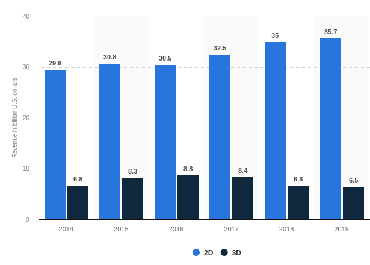

# Predicting Box-Office Receipts from the main film crew's Quotations
## Abstract

Recent research work has investigated the determinants of attributes (e.g., budget, release time) in predicting the box-office revenues[^Early-Predictions-of-Movie-Success]. Particularly, lead actors have been considered as one of the critical drivers for success in the motion pictures industry[^The-Power-of-Stars].

[^Early-Predictions-of-Movie-Success]: https://arxiv.org/abs/1506.05382
[^The-Power-of-Stars]: https://journals.sagepub.com/doi/10.1509/jmkg.71.4.102

However, an important attribute in forecasting the box-office receipts has remained mostly unnoticed: what and how the main film crew claim in the media coverage. Not only the fame of a lead actor/director can influence the box office revenue, but also the public claims from the main film crew might shape the audience attitudes and intentions to watch movie. One salient research question in our study is to examine *whether the main film crew's quotations in the press trigger an increase in the box office revenues over time.* We will perform various machine learning analysis using cross validation method to show what kind of characteristics in the director or a lead actor's quotation might be related to the box-office success.


## Introduction

The motion pictures industry has become a roaring success that reached a all time high 42 billion U.S. dollars in the global box office in 2019[^global-box-office-revenue-per-year]. In U.S. and Canada, the box office receipt is over 10 billion U.S. dollars in the year of 2015-2019.



[^global-box-office-revenue-per-year]: https://www.statista.com/statistics/259987/global-box-office-revenue

In recent years, numerous research work has uncovered which attributes might predict the financial success of motion pictures after they were released, and why some movies could be "hits" or "flops" using automation methods[^buzz-recommandation-internet][^blogs-advertising-local-market][^predicting-motion-picture].

[^buzz-recommandation-internet]: [Buzz et recommandations sur Internet: quels effets sur le box-office?](https://doi.org/10.1177%2F076737010702200304)
[^blogs-advertising-local-market]: [Blogs, Advertising, and Local-Market Movie Box Office Performance](https://doi.org/10.1287/mnsc.2013.1732)
[^predicting-motion-picture]: [Predicting box-office success of motion pictures with neural networks](https://doi.org/10.1016/j.eswa.2005.07.018)

In our study, we explore the important role of the claims from the main film crew on predicting the financial success of box-office receipts in 2015-2019 from the longitudinal time sequence (i.e., before and after the release date).
More specifically, we will address the following key questions:

* *Does the quantity of quotations from movie associated persons provide a boost to box-office revenue?*
* *Which textual factors from quotations influence the financial performance of movies, and when (i.e., before or after the release date)?*
* *Which model (e.g., logistic regression, SVM) has better predictive performance in forecasting the box-office receipts, given the quotations, its spread and the influential power of speaker?*

## Dataset Used

In our study, we combine the Quotebank database with the ```IMDb movie information database``` [^imdb-database] and box-office receipts from ```Box Office Mojo```[^mojo-database].

The first, ```IMDb movie database```, contains six types of movie data: (*i*) movie name title; (*ii*) the genre of movie, such as comedy, fantasy category; (*iii*) the release year (we select the movies in the year 2015-2019); (*iv*) region (focus on U.S. and U.K.); (*v*) runtime (in minutes).

The second, ```Box Office Mojo```, displayed the financial performance of movies in: (*i*) the gross revenue (in U.S. dollars, the average revenue??); (*ii*) ranking of box-office receipts; (*iii*) total gross revenue (???); (*iv*) release date and year.

After that, we merge both datasets together by movie name and release year. Further we extract key people in the movie (e.g., actors and actresses, director, and producer) in order to retrieve their quotations from the ```Quotebank``` database. By doing so, we assume that the spreading of quotation from movie associated key figure might influence the financial performance of the movies.

[^imdb-database]: [IMDb datasets](https://datasets.imdbws.com)
[^mojo-database]: [Box Office Mojo datasets](https://www.boxofficemojo.com/year/2015/)


## Methods

**box office receipts and quotations** 
In our preliminary analysis, we plot change of quantity in main crew’s quotations around the release date. There is a peak in the main crew’s quotations in the media coverage within one week after the movie has been released. Thus, we can assume that the main crew have been engaged in frequent media exposure for movie promotion around movie release dates. Further the spearman correlation graph shows, box office revenue and main crew’s quotations seem to follow some sort of power law (it is positive significant). 

**Genre difference in the effect of quotes on revenue**
Further we will examine the effect of the main crew’s quotations on revenue for each genre. We will perform a pair-wise KS statistic heatmap to show whether the genre differs in the main crew’s quotations, and plot the correlation graph between the main crew’s quotations and revenue for each movie category. 

**Main crew’s quotation frequency**
We compute the number of quotation occurrences for each movie related speaker. We consider top 20 speakers who have the highest number of quotation occurrences in the media coverage (vs. 20 lowest speakers). By doing so, we expect to examine whether the main crew who appear more often in the media coverage (vs. who has lowest media exposure) have greater influence on the box office revenue. 

**sentiment analysis and Topic detection**
We plan to pre-process text using NLP libraries (spacy, nltk, genism and sklearn). First, we will detect the sentiment polarity score from quotations with dictionary-based package Afinn. Second, we compute the number of topics for each speaker’s total quotations with LDA method (pyLDAvis from genism).

**Model for prediction**
We code the box office revenue in binary (flop = 0, blockbuster = 1). After that we train our predict models (e.g., logistic regression model, SVM and random forests) with cross-validation for our task. In the end we evaluate the accuracy rate for each predictive model.


## Project Timeline

**Week 1** (8 Nov-14 Nov): 
Project proposal, web scraping all available datasets, initial descriptive analysis

**Week 2** (22 Nov-28 Nov): 
Feature selection for all variables, compute textual characteristics of quotation (e.g., sentiment polarity, topic classification), compute influential power of speaker, data cleaning and standardized 

**Week 3** (29 Nov-5 Dec):
Training data to predictive models (e.g., SVM and neural network) with cross validation methods, evaluate the model performance 

**Week 4** (6 Dec-12 Dec):
Wrap up results, visualize data and write data story down

**Week 5** (13 Dec-17 Dec): 
Double check code and prepare the final storytelling about our data results 


## Organization within the team

* [Alex](https://github.com/PhotonAmpere): web scraping for datasets, initial data analysis, pre-process datasets, develop algorithm, model selection
* [Christos](https://github.com/Yo-art7): Data visualization, running tests and evaluate model performance
* [Pierre](https://github.com/pgimalac): develop algorithm, feature engineering, model selection
* [Yiming](https://github.com/yiming-li3008): analyze quotation text using NLP methods, write project data story

## Organization of the repository
    .
    ├── moviePreprocessing
    │   ├── movieDataSetBuilder.ipynb #pre-process and merge IMDb movie and box-office revenue datasets
    │   └── movie_data_2015_2020.csv #movie dataset: 2015-2020
    ├── mergeDataSets 
    │   └── link_quotes_to_movies.ipynb #merge quotabank and movie dataset by main crew names 
    ├── analysis
    │   └── analysis_quote.ipynb #prelimilary analysis for correlation between main crew quotations and box office receipts 
    
**Note:** All datasets with quotations whose speaker is in the main crew of a 2015-2020 movie can be found on [this google drive](https://drive.google.com/drive/folders/1q0zKAa45PFMZUMzclg4tjHwOMBS6QptM?usp=sharing).

